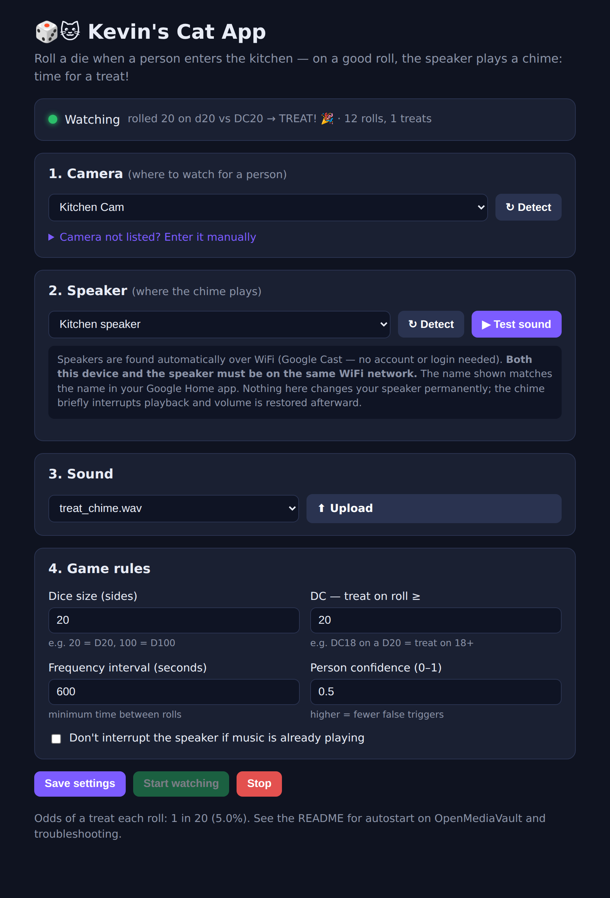

# 🎲🐱 Kevin's Cat App — D20 Treat Roller for Google Home

When a **person** walks into the kitchen, this app "rolls a die." On a good
enough roll it plays a celebratory chime on your **Google Home / Nest speaker** —
the cue that it's time to give the cat a treat. It watches an existing IP camera,
**ignores the cats** (it only triggers on people), and is configured entirely
from a simple web page.

- **No Docker, no Frigate, no cloud, no Google account.** Just Python.
- **One setup script**, then everything is point-and-click in a browser.
- Runs happily on an **OpenMediaVault** NAS (or any computer on the same WiFi).



<sub>The whole app is this one page (example shown with sample devices).</sub>

---

## Requirements

- **Python 3.11 or newer.** OpenMediaVault 7 (Debian 12) ships this already.
  (On older OMV 6 / Debian 11 you'd need a newer Python first — `setup.sh`
  checks the version and tells you exactly what to do if it's too old.)
- **`python3-venv` / `python3-pip`.** On a minimal Debian these may be missing;
  if so, `setup.sh` detects it and **offers to install them for you (just answer
  `Y`)**. If OpenCV ever complains about a missing library, run
  `sudo apt install libglib2.0-0`.
- This computer and your Google Home + camera must be on the **same WiFi/subnet**.

## Quick start

```bash
# 1. Get the code (clone or download the ZIP), then:
./setup.sh

# 2. Start it:
./venv/bin/python run.py
```

`run.py` prints a URL like `http://192.168.1.20:8080`. Open it in a browser on
the **same WiFi**, then:

1. **Camera** — pick your kitchen camera from the auto-detected list (or enter
   its stream URL manually).
2. **Speaker** — pick your Google Home from the auto-detected list, and press
   **Test sound** to hear the chime play on it.
3. **Sound** — keep the default chime or upload your own.
4. **Game rules** — set the dice size, the DC (how high you must roll to win a
   treat), and how often it's allowed to roll.
5. Press **Start watching**. Done!

> **Keep it running:** `run.py` stays running in your terminal until you press
> `Ctrl+C` (the camera-watching loop runs inside it; Start/Stop is in the GUI).
> If you launched it over SSH, closing the session stops it. To keep it running
> all the time and restart on boot, set up the
> [systemd service](#run-it-automatically-on-boot-openmediavault--systemd) below.

---

## How it works

```
 Kitchen IP camera ──▶ OpenCV reads the stream
                          │
                          ▼  motion? then run person-detection (MobileNet-SSD)
                  person detected (cats ignored)
                          │
                          ▼  roll a d{sides}; treat if roll ≥ DC; rate-limited
                     on a treat ──▶ Google Cast ──▶ 🔊 chime on your speaker
```

Everything is one Python process. It serves the web GUI **and** runs the
camera-watching loop in the background.

### Person vs. cat

Detection uses a small **MobileNet-SSD** neural network (bundled in
`d20app/models/`, runs on CPU via OpenCV — no GPU, no extra services). It knows
`person` and `cat` as separate categories, so it triggers on people and
**ignores the cats**. A cheap motion check runs first so the network only fires
when something actually moves, keeping CPU low.

### Google Home integration

The app talks to your speaker over the local network using the **Google Cast**
protocol (the same thing the "Cast" button uses). There is **no account, no
cloud login, and no API key**. It finds your speaker by the name shown in the
Google Home app. To play the sound it briefly serves the audio file from your
NAS and tells the speaker to play it.

**Will it interfere with my devices?** It only affects the *one* speaker you
choose. The short chime briefly interrupts whatever that speaker is playing
(it won't resume it), and the app **saves and restores the speaker's volume**,
so it leaves the device as it found it. Other speakers are untouched — unless
you pick a **speaker *group***, which plays on every speaker in it (the GUI
warns you when a choice is a group). There's also an optional "don't interrupt
if music is already playing" toggle.

---

## Finding your info (if auto-detect comes up empty)

Auto-detection needs the NAS and your devices to be on the **same WiFi/subnet**.
If something doesn't appear:

- **Speaker not listed?** Confirm the speaker and the NAS are on the same WiFi.
  The name must match what you see in the **Google Home app**. Some networks
  block mDNS between WiFi and Ethernet or across "guest" networks.
- **Camera not listed?** Auto-detect uses **ONVIF**. If your camera isn't ONVIF
  or needs a login, open the **"Camera not listed?"** section in the GUI and
  enter the **RTSP URL** plus username/password. Find the RTSP URL in your
  camera's app or web page (often `rtsp://<camera-ip>:554/...`); the camera's IP
  is in your **router's device list** or the camera app.

---

## Configuration

You normally never edit config by hand — the GUI writes `config.yaml` for you.
Every setting is documented in [`config.example.yaml`](config.example.yaml)
(dice size, DC, frequency interval, detection confidence, optional region of
interest, ports, etc.).

---

## Run it automatically on boot (OpenMediaVault / systemd)

Optional, but recommended for an always-on setup. Create
`/etc/systemd/system/kevins-cat-app.service` — **replace both
`/path/to/Kevin-s-Cat-App` with the real folder path** (run `pwd` inside it to
get it), and set `User=` to the account that owns that folder (the app doesn't
need root):

```ini
[Unit]
Description=Kevin's Cat App
After=network-online.target
Wants=network-online.target

[Service]
User=youruser
WorkingDirectory=/path/to/Kevin-s-Cat-App
ExecStart=/path/to/Kevin-s-Cat-App/venv/bin/python run.py
Restart=on-failure

[Install]
WantedBy=multi-user.target
```

Then enable and start it:

```bash
sudo systemctl daemon-reload
sudo systemctl enable --now kevins-cat-app
```

It now starts on boot and the GUI is always available at `http://<nas-ip>:8080`.
Check it with `systemctl status kevins-cat-app` or `journalctl -u kevins-cat-app -f`.

---

## Stopping it & troubleshooting

**To stop watching but keep the page open:** press **Stop** in the GUI. That
halts the camera loop only; the web server stays up so you can reconfigure and
Start again. To stop the whole program, use whichever matches how you started it:

| How you started it | How to stop it |
|---|---|
| In a terminal / over SSH (`./venv/bin/python run.py`) | Press **Ctrl+C** (closing the SSH session also stops it). |
| As a systemd service | `sudo systemctl stop kevins-cat-app` (add `sudo systemctl disable kevins-cat-app` to stop it starting on boot). |
| In the background / lost the terminal | `pkill -f run.py`, or find it with `ps aux \| grep run.py` and `kill <pid>`. Since it holds port 8080, `sudo lsof -i :8080` also finds it. |

It shuts down cleanly either way — the camera loop and sound server are
background (daemon) threads, so they stop with the main process and leave
nothing running. Your settings are already saved to `config.yaml`.

**"Address already in use" on start?** Something else on the NAS is using port
**8080** (the GUI) or **8081** (the sound server) — some OMV plugins and Docker
containers use 8080. Pick free ports by setting `web_port` / `file_server_port`
in `config.yaml`, then start again.

**A note on access:** the GUI and the sound server have no password, so anyone
already on your home WiFi can open the page. It's only reachable on your local
network (nothing is exposed to the internet), which is fine for a home setup —
just don't run it on an untrusted/shared network.

---

## Development

```bash
./venv/bin/python -m pip install pytest
./venv/bin/python -m pytest        # dice/rate-limit + person-vs-cat tests
```

- `d20app/dice.py` — rolling, DC check, cooldown gate (pure, fully tested).
- `d20app/detector.py` — motion pre-filter + person detection (cats ignored).
- `d20app/caster.py` — Google Cast playback + local sound file server.
- `d20app/discovery.py` — speaker (Cast) and camera (ONVIF) auto-detection.
- `d20app/loop.py` — the background watch→roll→cast loop.
- `d20app/webapp.py` + `templates/` + `static/` — the web GUI.

A spoken-message option ("Give the cat a treat!") is stubbed in
`caster.say()` for a future update.
